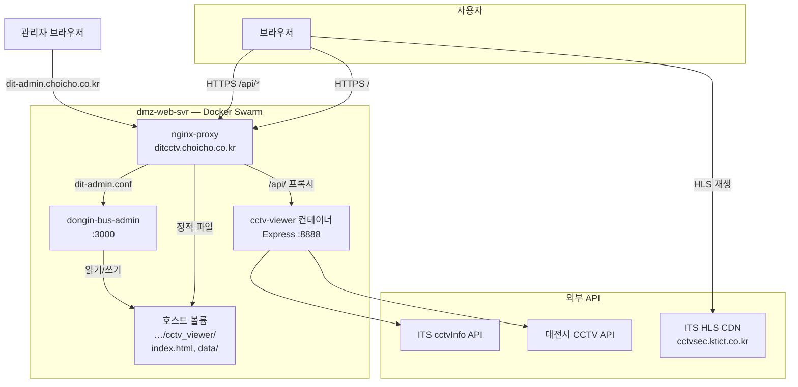

# CCTV 조회 시스템 운영 가이드

동인여객 버스 **노선별 실시간 CCTV 뷰어**(`ditcctv.choicho.co.kr`)의 서버 구성, 소스 파일 역할, 관리자 페이지 사용법을 정리한 문서입니다.

| 항목 | URL / 경로 |
|------|------------|
| **CCTV 조회 사이트 (사용자)** | https://ditcctv.choicho.co.kr/ |
| **소스 관리 페이지 (관리자)** | https://dit-admin.choicho.co.kr/dit-admin/ |
| **저장소 소스 루트** | `dongin_bus/cctv_viewer/` |
| **운영 서버 호스트 경로** | `/project2/gimmeQUIZ2.0/public/dongin_bus/cctv_viewer/` |

로그인 계정은 서버 환경변수 `ADMIN_USER` / `ADMIN_PASS` 로 설정됩니다. (`dongin-bus-admin` 컨테이너, `docker/env/dongin-bus-admin.env` 참고)

---

## 1. 시스템 개요

CCTV 조회 시스템은 **브라우저 화면(프론트)** 과 **CCTV 목록·스트림 URL API(백엔드)** 로 구성됩니다. 외부 ITS·대전시 공공 API에서 CCTV 메타데이터와 HLS 스트림 URL을 받아, 노선 정류장 좌표와 매칭한 뒤 사용자에게 보여 줍니다.

### 1.1 전체 아키텍처



### 1.2 요청 흐름 (사용자)

1. `https://ditcctv.choicho.co.kr/` → nginx가 **`cctv_viewer/index.html`** 을 정적 서빙
2. 페이지가 **`GET /api/cctv-route?route=501`** 호출 → nginx가 **`cctv-viewer:8888`** 로 프록시
3. 백엔드가 `data/routes.json` 의 정류장 좌표로 bbox 계산 → ITS·대전 API 조회 → 반경 내 CCTV 매칭
4. 브라우저가 응답의 `streamUrl`(HLS)로 **HLS.js** 재생 (ITS CDN 직접 접속)

### 1.3 관리자 페이지와의 관계

| 구분 | 관리 대상 | 반영 방식 |
|------|-----------|-----------|
| **소스 관리 UI** | `index.html`, `data/routes.json` | 호스트 디렉터리에 즉시 저장 → nginx 정적 / API 디스크 재읽기 |
| **Docker 이미지** | `server.js`, `netlify/functions/*` 등 | **이미지 빌드·배포** 필요 (관리 UI로 불가) |
| **환경 변수** | API 키, 캐시 TTL 등 | Swarm `env_file` 또는 `docker service update` |
| **nginx 설정** | `dit-viewer.conf` | Worker 호스트 `~/nginx/conf.d/` → nginx-proxy reload |

---

## 2. 서버 구성 상세

### 2.1 Docker Swarm 서비스

| 서비스명 | 이미지 | 역할 | 배포 노드 |
|----------|--------|------|-----------|
| `quiz-proxmox_nginx-proxy` | `nginx:alpine` | TLS 종료, 정적 파일, API 역프록시 | dmz-web |
| `quiz-proxmox_cctv-viewer` | `choicho/dongin-bus-cctv-viewer:*` | Express API (`/api/cctv-route` 등) | dmz-web |
| `quiz-proxmox_dongin-bus-admin` | `dongin-bus-admin:*` | 소스 관리 UI·API (`/dit-admin/`) | dmz-web |

### 2.2 호스트 디렉터리 (dmz-web-svr)

```
/project2/gimmeQUIZ2.0/public/dongin_bus/
├── index.html                    ← ditransfer (환승 안내, 별도 관리)
└── cctv_viewer/                  ← CCTV 조회 (본 문서 대상)
    ├── index.html                ← ★ 관리 UI로 수정 가능
    ├── index.html_YYYYMMDD_HHmmss   ← index.html 백업
    ├── data/
    │   ├── routes.json           ← ★ 관리 UI로 수정 가능
    │   └── routes.json_YYYYMMDD_HHmmss
    └── (기타: node_modules 등은 Docker 이미지 내부)
```

**동일 경로 마운트**

- **nginx-proxy**: `…/public` → `/project2/gimmeQUIZ2.0/public` (읽기 전용)
- **dongin-bus-admin**: `…/public/dongin_bus` → `/srv/dongin_bus` (읽기/쓰기)
- **cctv-viewer**: API·로직만 컨테이너 이미지, **`routes.json` 은 nginx 볼륨 경로와 동일 호스트 파일**을 디스크에서 읽음 (컨테이너에 data 마운트 없음 — API가 ITS 호출, routes는 admin이 올린 파일을 nginx `/data/` 와 공유)

> **참고:** `routes.json` 은 관리 UI로 호스트에 올리면 nginx `/data/routes.json` 과 `cctv-viewer` API가 다음 요청부터 디스크 기준으로 읽습니다. `routes.json` 변경 시 서버 메모리 캐시도 자동 무효화됩니다.

### 2.3 nginx 설정

| 파일 | 호스트 위치 | 설명 |
|------|-------------|------|
| `nginx/conf.d/dit-viewer.conf` | `~/nginx/conf.d/dit-viewer.conf` | `ditcctv.choicho.co.kr` vhost |
| `nginx/conf.d/dit-admin.conf` | `~/nginx/conf.d/dit-admin.conf` | `dit-admin.choicho.co.kr` → admin 컨테이너 |

`dit-viewer.conf` 핵심:

- `root` → `…/public/dongin_bus/cctv_viewer`
- `location /api/` → `http://cctv-viewer:8888/api/`
- `location /data/` → `…/cctv_viewer/data/` (routes.json)

### 2.4 환경 변수 (`docker/env/cctv-viewer.env`)

| 변수 | 기본값 | 설명 |
|------|--------|------|
| `ITS_API_KEY` | (필수) | ITS 국가교통정보센터 Open API 키 |
| `DAEJEON_API_KEY` | (필수) | 대전시 공공데이터 API 키 |
| `ITS_CCTV_TYPE` | `4` | HTTPS HLS URL 요청 (혼합 콘텐츠 방지) |
| `CACHE_TTL` | `900` | CCTV 목록 캐시(초), 15분 |
| `STREAM_URL_MAX_AGE` | `180` | ITS streamUrl 재발급 주기(초), 3분 |
| `MAX_DISTANCE` | `500` | 정류장–CCTV 매칭 반경(m) |
| `PLAYABLE_ONLY` | `1` | 스트림 URL 없는 CCTV 카드 숨김 |
| `ITS_BBOX_EXTRA_PADDING` | `0.02` | ITS 조회 bbox 추가 확장(도) |
| `LOG_LEVEL` | `info` | 서버 로그 (`debug` 시 상세) |

---

## 3. 소스 파일 목록 및 역할

### 3.1 관리자 UI로 **직접 관리 가능**한 파일

| 파일 | URL에서의 역할 | 수정 시 영향 |
|------|----------------|--------------|
| **`index.html`** | CCTV 뷰어 전체 UI (노선 탭, HLS 재생, API 호출) | 저장 후 **브라우저 새로고침**만으로 반영. Docker 재시작 불필요 |
| **`data/routes.json`** | 노선별 정류장 좌표(상·하행). API bbox·CCTV 매칭의 기준 | 저장 후 **다음 API 요청**부터 반영. 노선 추가/정류장 변경 시 필수 |

### 3.2 저장소 내 전체 파일 (역할 참고)

| 경로 | 역할 | 관리 UI | 배포 방법 |
|------|------|---------|-----------|
| `index.html` | 프론트엔드 (Vanilla JS + HLS.js) | ✅ | 업로드 |
| `data/routes.json` | 노선·정류장 JSON | ✅ | 업로드 |
| `server.js` | Express 진입점, `/api/*` 라우팅 | ❌ | Docker 이미지 |
| `netlify/functions/cctv-route.js` | 노선별 CCTV 조회 API | ❌ | Docker 이미지 |
| `netlify/functions/cctv-cache.js` | ITS URL 캐시 (bbox별, TTL) | ❌ | Docker 이미지 |
| `netlify/functions/cctv-refresh.js` | 캐시 강제 갱신 API | ❌ | Docker 이미지 |
| `netlify/functions/cctv-diagnostics.js` | 진단 API (`?route=501`) | ❌ | Docker 이미지 |
| `netlify/functions/api-client.js` | ITS·대전 API 클라이언트 | ❌ | Docker 이미지 |
| `netlify/functions/utils.js` | bbox, 정류장 매칭 유틸 | ❌ | Docker 이미지 |
| `netlify/functions/logger.js` | 구조화 로그 | ❌ | Docker 이미지 |
| `package.json` | npm 의존성 | ❌ | Docker 이미지 |
| `Dockerfile` | 컨테이너 빌드 정의 | ❌ | `docker/build-image-cctv.sh` |
| `scripts/extract-routes.js` | ditransfer `index.html` → `routes.json` 추출 (로컬 개발용) | ❌ | Git만 |
| `.env.example` | 로컬/배포 env 템플릿 | ❌ | 서버 `cctv-viewer.env` |
| `docker-compose.yml` | 로컬 Compose | ❌ | 참고용 |

### 3.3 `index.html` 주요 동작

- 노선 탭: `108`, `501`, `511`, `513`
- **페이지 로드/새로고침** 시 `GET /api/cctv-route?route=…&refresh=1` (만료된 ITS URL 방지)
- **노선 탭 전환** 시 `refresh` 없이 캐시 활용
- HLS 재생 실패·타임아웃 시 자동으로 `refresh=1` 재요청
- 디버그: URL에 `?debug=1` 또는 콘솔 `[CCTV-*]` 로그

### 3.4 `data/routes.json` 구조

```json
{
  "501": {
    "up": [
      { "name": "정류장명", "sid": "51590", "lat": 36.36, "lng": 127.45 }
    ],
    "down": [ … ]
  },
  "108": { … }
}
```

- 키: 노선 번호 문자열
- `up` / `down`: 정류장 배열 (이름, ID, 위·경도)
- ditransfer `index.html` 의 노선 데이터와 **동기화**가 필요하면 `scripts/extract-routes.js` 로 재생성 후 업로드

---

## 4. 소스 관리 페이지 사용법

### 4.1 접속 및 로그인

1. 브라우저에서 https://dit-admin.choicho.co.kr/dit-admin/ 접속
2. **아이디 / 비밀번호** 입력 후 **로그인**
3. 상단은 **ditransfer `index.html`** 관리, 하단 **「CCTV 뷰어 소스 (`cctv_viewer/`)」** 패널이 CCTV 전용

> CCTV 패널이 보이지 않으면 `CCTV_ADMIN_ENABLED=0` 일 수 있습니다. 서버 env 확인.

### 4.2 CCTV 패널 상태 확인

로그인 후 CCTV 섹션에 표시되는 정보:

- `cctvViewerDir` — 서버의 실제 경로 (예: `/srv/dongin_bus/cctv_viewer`)
- `indexExists` / `routesExists` — 파일 존재 여부
- `backupsIndex` / `backupsRoutes` — 백업 목록·개수

### 4.3 `index.html` — 다운로드 → 수정 → 업로드

**권장 작업 순서**

1. **다운로드** — 「index.html 다운로드」→ 로컬에 `cctv-index.html` 등으로 저장
2. **로컬 수정** — 에디터로 UI·문구·HLS 옵션 등 편집
3. **업로드** — 「파일 선택」→ 수정본 선택 → **업로드**
4. **확인** — https://ditcctv.choicho.co.kr/ **강력 새로고침**(Ctrl+Shift+R / Cmd+Shift+R)

**자동 백업**

- 업로드 직전 현재 파일 → `cctv_viewer/index.html_YYYYMMDD_HHmmss`
- 최대 `MAX_BACKUPS`(기본 30)개 유지, 초과분 자동 삭제

### 4.4 `index.html` — 백업으로 롤백

1. 「백업으로 롤백」 드롭다운에서 복원할 백업 선택 (최신이 위)
2. **선택 백업으로 롤백** 클릭
3. 롤백 **전** 현재 `index.html` 도 새 백업으로 보존됨
4. ditcctv 사이트에서 새로고침 후 확인

### 4.5 `index.html` — 백업 삭제

1. 「index.html 백업 삭제」 목록에서 삭제할 항목 체크
2. **선택 항목 삭제** — 디스크에서만 제거, **복구 불가**
3. **현재 운영 중인 `index.html` 은 삭제되지 않음**

### 4.6 `data/routes.json` — 다운로드 → 수정 → 업로드

1. **다운로드** — 「routes.json 다운로드」
2. JSON 편집 (노선 추가, 정류장 좌표 수정 등). **유효한 JSON** 이어야 업로드 가능
3. **업로드** — 적용 전 `data/routes.json_YYYYMMDD_HHmmss` 백업
4. API 확인: `curl -s "https://ditcctv.choicho.co.kr/api/cctv-route?route=501" | jq .cctvCount`

**routes.json 만 바꿀 때**

- Docker **재시작 불필요**
- 변경 감지 시 CCTV API **메모리 캐시 자동 초기화**

### 4.7 `routes.json` — 롤백·백업 삭제

- UI 흐름은 `index.html` 과 동일 (대상만 `routes.json`)
- 백업 파일 위치: `cctv_viewer/data/routes.json_YYYYMMDD_HHmmss`

### 4.8 관리 API (자동화·스크립트용)

로그인 세션 쿠키 필요. UI와 동일 기능.

| 메서드 | 경로 | 설명 |
|--------|------|------|
| GET | `/dit-admin/api/status` | ditransfer + **cctv** 상태 |
| GET | `/dit-admin/api/cctv/download?target=index` | index.html 다운로드 |
| GET | `/dit-admin/api/cctv/download?target=routes` | routes.json 다운로드 |
| POST | `/dit-admin/api/cctv/upload` | `multipart`: `file`, `target=index\|routes` |
| POST | `/dit-admin/api/cctv/rollback` | JSON `{ "target", "backupName"? }` |
| POST | `/dit-admin/api/cctv/delete-backup` | JSON `{ "target", "backupNames": [] }` |

---

## 5. 백엔드(API) 변경 시 배포

`server.js`, `netlify/functions/*` 등 **Docker 이미지 안의 파일**은 관리 UI로 올릴 수 없습니다.

### 5.1 로컬에서 이미지 빌드·업로드

```bash
cd /path/to/gobus

# 빌드 + Worker(166) 업로드 (cctv 기본)
IMAGE_TAG=20260523 ./docker/build-and-upload-image-cctv.sh

# Swarm 워커 노드에도 이미지 필요 시
IMAGE_TAG=20260523 DEPLOY_SERVER=quizadm@192.168.219.166 ./docker/upload-image-to-server-cctv.sh
```

### 5.2 Swarm 서비스 갱신 (Manager, 196)

```bash
ssh quizadm@192.168.219.196
docker service update --image choicho/dongin-bus-cctv-viewer:20260523 quiz-proxmox_cctv-viewer
docker service ps quiz-proxmox_cctv-viewer
```

### 5.3 정적 파일만 변경한 경우

```bash
./docker/deploy-static-files.sh
```

`index.html`, `data/` 를 Worker에 복사하고 nginx reload.

### 5.4 환경 변수 변경

```bash
# 예: streamUrl 재발급 주기 조정
docker service update \
  --env-add STREAM_URL_MAX_AGE=120 \
  quiz-proxmox_cctv-viewer
```

또는 `~/docker/env/cctv-viewer.env` 수정 후 `docker stack deploy` (운영 정책에 따름).

---

## 6. 공개 API (운영·점검)

| 엔드포인트 | 설명 |
|------------|------|
| `GET /api/cctv-route?route=501` | 노선 CCTV 목록 + streamUrl |
| `GET /api/cctv-route?route=501&refresh=1` | 캐시 무시, ITS URL 재발급 |
| `GET /api/cctv-route?route=501&debug=1` | 진단용 `_debug` 필드 포함 |
| `GET /api/cctv-diagnostics?route=501` | 환경·매칭·힌트 JSON |
| `GET /api/cctv-refresh` | 전역 CCTV 캐시 갱신 (Cron/수동) |

**점검 예시**

```bash
# API 상태
curl -s "https://ditcctv.choicho.co.kr/api/cctv-route?route=501&refresh=1" | jq '{cctvCount, cacheAge, refreshed, streamUrlMaxAge}'

# 진단
curl -s "https://ditcctv.choicho.co.kr/api/cctv-diagnostics?route=501" | jq '.hints, .matchSummary'

# 컨테이너 로그 (Manager)
docker service logs quiz-proxmox_cctv-viewer --tail 50
```

---

## 7. 자주 하는 작업 시나리오

### 7.1 화면 문구·노선 탭 UI만 변경

1. dit-admin → CCTV → **index.html 다운로드**
2. 로컬 수정 → **업로드**
3. ditcctv **새로고침** (캐시 무시: Ctrl+Shift+R)

### 7.2 새 노선 추가 또는 정류장 좌표 수정

1. ditransfer `index.html` 과 맞출 경우: 로컬에서 `node scripts/extract-routes.js` 로 `routes.json` 생성 (선택)
2. dit-admin → **routes.json 업로드**
3. `index.html` 에 노선 탭·`changeRoute('…')` 버튼 추가 필요 시 index도 함께 업로드
4. ditcctv에서 해당 노선 탭 클릭 후 CCTV 개수 확인

### 7.3 실수로 잘못 올렸을 때

1. dit-admin → 해당 파일 **백업 롤백** (직전 백업 선택)
2. 또는 백업 목록에서 특정 시각 `index.html_20260523_071751` 등 선택

### 7.4 영상이 안 나올 때 (운영)

| 증상 | 확인 | 조치 |
|------|------|------|
| 「영상 신호 수신 중…」 지속 | `?debug=1`, 진단 API | 최신 `index.html`·이미지 배포 여부 확인; `refresh=1` 동작 확인 |
| CCTV 0개 | `routes.json` 노선 키, 좌표 | routes 업로드·롤백 |
| API 500 | `docker service logs` | `ITS_API_KEY`, `DAEJEON_API_KEY` |
| HTTP 스트림 차단 | 진단 `ITS_CCTV_TYPE` | `ITS_CCTV_TYPE=4` 유지 |

### 7.5 routes.json 로컬 생성 (개발 PC)

```bash
cd dongin_bus/cctv_viewer
# ditransfer index.html 경로를 참조하도록 스크립트 설정 후
node scripts/extract-routes.js
# 생성된 data/routes.json 을 관리 UI로 업로드
```

---

## 8. 보안·운영 주의

1. **관리자 비밀번호** — 기본값 사용 금지. `ADMIN_PASS`, `SESSION_KEYS` 는 배포 env에서 관리
2. **API 키** — `cctv-viewer.env` 는 Git에 커밋하지 않음
3. **업로드 검증** — HTML은 `<!DOCTYPE`/`<html` 검사, routes는 JSON 파싱 검사
4. **백업** — 업로드·롤백마다 자동 생성; 중요 변경 전 **수동 다운로드** 권장
5. **동시 편집** — 두 관리자가 동시 업로드하면 나중 업로드가 덮어씀

---

## 9. 관련 문서·스크립트

| 문서/스크립트 | 위치 |
|---------------|------|
| dongin_bus 관리 서버 README | `dongin_bus/dongin_bus_admin-server/README.md` |
| CCTV 개발 README | `dongin_bus/cctv_viewer/README.md` |
| Docker 배포 | `dongin_bus/cctv_viewer/DOCKER_DEPLOYMENT.md`, `docker/DEPLOY_CCTV_VIEWER.md` |
| nginx (ditcctv) | `nginx/conf.d/dit-viewer.conf` |
| nginx (관리자) | `nginx/conf.d/dit-admin.conf` |
| Swarm 스택 | `docker/swarm-stack-proxmox.yml` |
| 이미지 빌드 | `docker/build-and-upload-image-cctv.sh` |
| 정적 배포 | `docker/deploy-static-files.sh` |

---

## 10. 운영 체크리스트 (요약)

- [ ] ditcctv 메인·4개 노선 탭에서 CCTV 카드·영상 재생 확인
- [ ] 새로고침 후에도 영상 재생 (`refresh=1` / STREAM_URL_MAX_AGE)
- [ ] dit-admin CCTV 패널: `indexExists`, `routesExists` true
- [ ] 진단 API `hints` 에 치명 오류 없음
- [ ] `docker service ps quiz-proxmox_cctv-viewer` — 1/1 Running
- [ ] API 키 만료·할당량 (ITS, 대전) 주기 점검
- [ ] 백업 개수·디스크 (`MAX_BACKUPS` 이내)

---

*문서 버전: 2026-05-23 — STREAM_URL_MAX_AGE·관리 UI CCTV API·bbox 캐시 반영*
